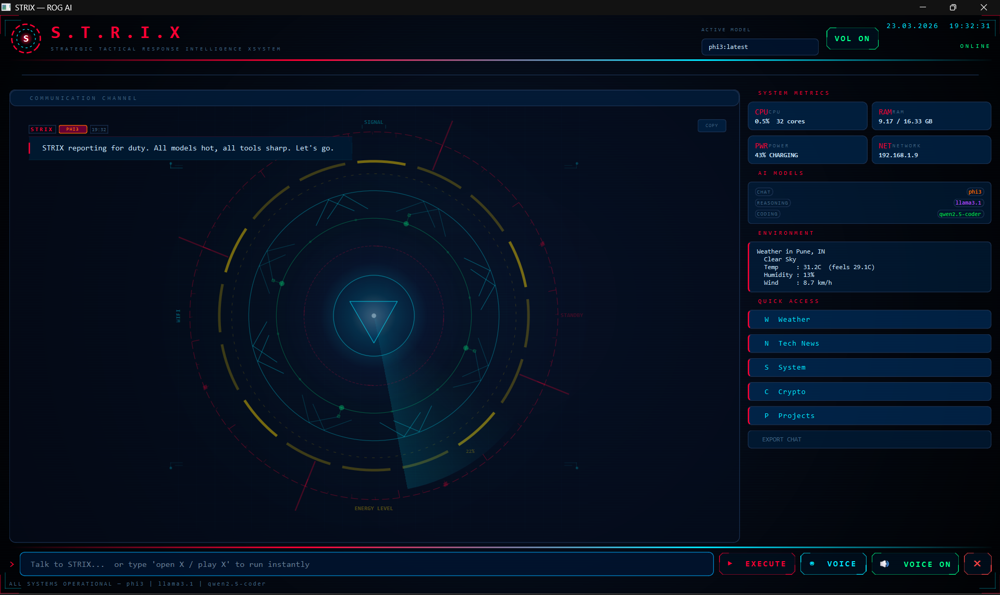

<div align="center">


# S.T.R.I.X
### Strategic Tactical Response Intelligence Xystem


**A cinematic ROG-themed AI desktop assistant with a tactical HUD & Obsidian Vault Memory.**  
**Runs 100% locally on your PC using Ollama — no cloud, no subscriptions, complete privacy.**

</div>

---

## Preview

> Tactical HUD interface · Voice input · Obsidian memory vault · Real-time system stats · Live APIs

```
[STRIX] STRIX reporting for duty. All models hot, all tools sharp. Let's go.
[YOU]   write addition and subtraction code in python
[STRIX] Here is your Python code: ...
[YOU]   now in java
[STRIX] Here is the Java version of addition and subtraction: ...
[YOU]   system status
[STRIX] CPU: 0.5% | 32 Cores | RAM: 9.17 / 16.33 GB | PWR: 43% CHARGING | NET: 192.168.1.9
```

---

## Screenshot



> *STRIX HUD — Communication Channel, System Metrics, Quick Access panel, and the tactical radar display running live on Windows.*

---

## Features

| Category | What STRIX Can Do |
|---|---|
| **AI Chat** | Natural conversation using local Ollama models (`phi3`, `llama3.1`, `qwen2.5-coder`) |
| **Context Memory** | Remembers conversation flow naturally (e.g. follow-up requests like *"now in java"* work seamlessly) |
| **Obsidian Vault Memory** | Automatically logs daily notes (`Daily Notes/YYYY-MM-DD.md`) & generates visual `[[wikilinks]]` graph |
| **Background Supervisor** | Ultra-lightweight Windows startup background process (< 2MB RAM, 0% CPU) with auto-restart |
| **Performance Engine** | SQLite WAL mode concurrency & Qt widget pruning (capped at 150 items) for lag-free long sessions |
| **Voice** | Speak to STRIX, hear responses via TTS (Hinglish/English support) |
| **Desktop Control** | Create files, folders, open apps on Windows |
| **Weather** | Live weather for your city (OpenWeatherMap) |
| **News** | Latest tech headlines via NewsAPI |
| **Crypto** | Live Bitcoin, Ethereum, and top coin prices |
| **Wikipedia** | Instant knowledge lookup |
| **Currency** | Real-time exchange rates (USD, INR, EUR, etc.) |
| **NASA** | Astronomy Picture of the Day |
| **GitHub** | Look up any GitHub profile |
| **IP Info** | Your public IP and location |
| **System Stats** | Live CPU, RAM, Battery, Network — shown on HUD |
| **Projects** | Generate Java, Python, C, C++ project templates |

---

## AI Models

STRIX uses three specialized local models via Ollama:

| Role | Model | Purpose |
|---|---|---|
| **Chat** | `phi3:latest` | Fast general conversation & quick answers |
| **Reasoning** | `llama3.1` | Deep thinking, analysis, and planning |
| **Coding** | `qwen2.5-coder` | Software development, code generation, and debugging |

Switch the active model from the HUD's **AI MODELS** panel at any time.

---

## Obsidian Vault Memory Integration

STRIX integrates directly with [Obsidian](https://obsidian.md) for long-term persistent memory:

- **Daily Notes (`Daily Notes/YYYY-MM-DD.md`)**: Automatically logs every chat turn, code snippet, and task summary into daily Markdown notes.
- **Wikilink Graph (`[[Topic]]`)**: Auto-tags topics (e.g. `[[Python]]`, `[[Java]]`, `[[Coding]]`), allowing you to explore STRIX's visual memory graph in Obsidian (`Ctrl + G`).
- **User Profile (`User Profile.md`)**: Remembers user preferences, preferred tech stack, and coding style.

---

## Project Structure

```
strix/
├── strix.py                # Entry point
├── strix_gui.py            # Tactical ROG-themed PySide6 HUD (optimized for long sessions)
├── strix_tts.py            # Text-to-speech engine
├── STRIX_SUPERVISOR.vbs    # Lightweight Windows startup background supervisor
├── STOP_SUPERVISOR.bat     # Helper script to pause auto-restart background supervisor
├── START_STRIX.vbs         # One-click launcher (starts Ollama + STRIX)
├── CREATE_SHORTCUT.vbs     # Creates Desktop shortcut
├── requirements.txt
├── .env                    # Environment config & API keys (not in git)
│
├── api/
│   ├── weather.py          # OpenWeatherMap
│   ├── news.py             # NewsAPI
│   └── extras.py           # Crypto, Wikipedia, NASA, IP, Currency, GitHub
│
├── brain/
│   ├── core.py             # Central brain controller
│   ├── input_processor.py  # Voice + text processing
│   ├── planner.py          # LLM task planner
│   ├── router.py           # Context-aware LLM & tool router
│   └── executor.py         # Executes task plans
│
├── memory/
│   ├── memory_db.py        # SQLite WAL concurrency memory system
│   ├── obsidian_memory.py  # Obsidian Vault daily notes & wikilinks manager
│   └── strix_memory.db     # Auto-created SQLite DB
│
├── strix core/             # Obsidian Vault directory
│   ├── Daily Notes/        # Auto-generated daily memory notes
│   ├── User Profile.md     # User preferences note
│   └── .obsidian/          # Obsidian configuration
│
├── models/
│   └── llm_interface.py    # Ollama API calls with HTTP connection pooling
│
└── tools/
    ├── system_tools.py     # CPU, RAM, battery, network
    ├── search_tools.py     # File search and reading
    ├── project_tools.py    # Project generators
    └── windows_tools.py    # Desktop file and app control
```

---

## Installation

### Requirements
- Windows 10 or 11
- Python 3.11 or newer
- [Ollama](https://ollama.com) installed
- [Obsidian](https://obsidian.md) (Optional, for visual memory graph)

### Step 1 — Clone the repo
```bash
git clone https://github.com/prahaldgadekar/strix-ai.git
cd strix-ai
```

### Step 2 — Install Python dependencies
```bash
pip install -r requirements.txt
```

### Step 3 — Pull Ollama models
```bash
ollama pull phi3
ollama pull llama3.1
ollama pull qwen2.5-coder:7b
```

### Step 4 — Set up environment & vault path
```bash
copy .env.example .env
```
Open `.env` and set your Obsidian vault path (default is `e:\Strix\strix core`):
```env
OBSIDIAN_VAULT_PATH=e:\Strix\strix core
```

### Step 5 — Enable Background Startup (Optional)
Copy `STRIX_SUPERVISOR.vbs` to your Windows Startup folder (`shell:startup`) for instant background startup and auto-restart capability.

### Step 6 — Launch STRIX
```
Double-click START_STRIX.vbs
```
STRIX starts Ollama automatically every time.

---

## API Keys

All APIs have free tiers. No credit card required.

| API | Get Key | Free Limit |
|---|---|---|
| OpenWeatherMap | [openweathermap.org/api](https://openweathermap.org/api) | 1,000 calls/day |
| NewsAPI | [newsapi.org](https://newsapi.org) | 100 calls/day |
| NASA | [api.nasa.gov](https://api.nasa.gov) | Unlimited |
| GitHub | [github.com/settings/tokens](https://github.com/settings/tokens) | 5,000/hour |

> Crypto, Wikipedia, IP info, Currency, and Jokes work with **no API key at all**.

---

## Usage Examples

Just type or speak naturally:

```
weather                          → Live weather for your city
bitcoin price                    → Current BTC price in USD and INR
top crypto                       → Top 5 coins by market cap
who is APJ Abdul Kalam           → Wikipedia summary
tell me a joke                   → Programming joke
NASA picture today               → Astronomy Picture of the Day
my ip address                    → Your public IP and location
USD to INR                       → Live exchange rate
latest tech news                 → Top 5 headlines
system status                    → CPU, RAM, battery info
create file on desktop named X   → Creates X.txt on Desktop
create folder named Projects     → Creates folder on Desktop
open notepad                     → Opens Notepad
write addition code in python   → AI generates code
now in java                      → Context-aware conversion to Java
```

---

## Voice Mode

Click the **VOICE** button or use the wake word. STRIX will:
1. Listen for your command (supports English + Hindi mixed accents)
2. Process it through the active model
3. Speak the response out loud

Toggle voice output anytime with the **VOL ON / VOL OFF** button on the HUD.

---

## Built With

- [PySide6](https://doc.qt.io/qtforpython/) — Desktop GUI (ROG tactical theme)
- [Ollama](https://ollama.com) — Local AI models
- [Obsidian](https://obsidian.md) — Visual memory vault & Markdown daily notes
- [phi3](https://ollama.com/library/phi3) — Fast chat model
- [llama3.1](https://ollama.com/library/llama3.1) — Reasoning model
- [qwen2.5-coder](https://ollama.com/library/qwen2.5-coder) — Coding model
- [SpeechRecognition](https://pypi.org/project/SpeechRecognition/) — Voice input
- [pyttsx3](https://pypi.org/project/pyttsx3/) — Text to speech
- [SQLite](https://www.sqlite.org/) — WAL mode concurrency session memory

---

## Made By

**Prahlad Gadekar** — Computer Engineering Student, Pune, India

[](https://github.com/prahaldgadekar)
[](https://linkedin.com/in/prahladgadekar)

---

<div align="center">
<i>STRIX reporting for duty. All models hot, all tools sharp. Let's go.</i>
</div>
